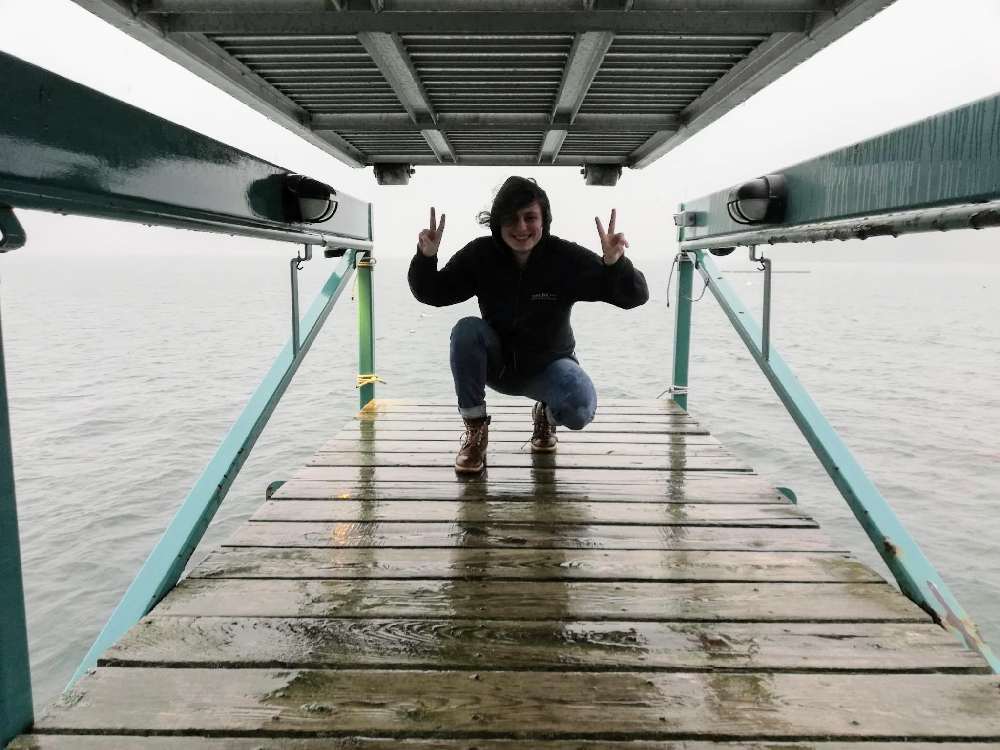

I'm a French-British human ecologist, data scientist, and scientific programmer specialized in complex systems and geospatial data.

I currently work at Wolfram Research as an Applications Developer.

I'm an alum of the 2025 Complexity Global School, co-organized by the Santa Fe Institute and Universidad de Los Andes. Every year since 2024, I've mentored at the Wolfram Summer Research Institute, which I attended as a student in 2023. In 2022, I was a NOAA data science intern and Wolfram Research Student Ambassador. I am a United World Colleges alum from Robert Bosch College, class of 2017.

I have a deep interest in complex systems, social and cognitive sciences, computer science, and process-driven art. My skills are broadly applicable in many scientific fields, and I am a collaborative, meticulous and very fast learner.

I come from a family of teachers, musicians, and sailors, and I feel a profound attachment to education, the arts, and the ocean.

---

## Contact & Inquiries

For consulting, research collaborations, or other business-related inquiries, please reach out via email or LinkedIn:
- **Email:** <a href="mailto:phileasdg@gmail.com">phileasdg [at] gmail.com</a>
- **LinkedIn:** [linkedin.com/in/phileas](https://www.linkedin.com/in/phileas/)

For speaking events, general networking, or other inquiries, feel free to contact me through Instagram:
- **Instagram:** [@phileasdg](https://www.instagram.com/phileasdg/)

