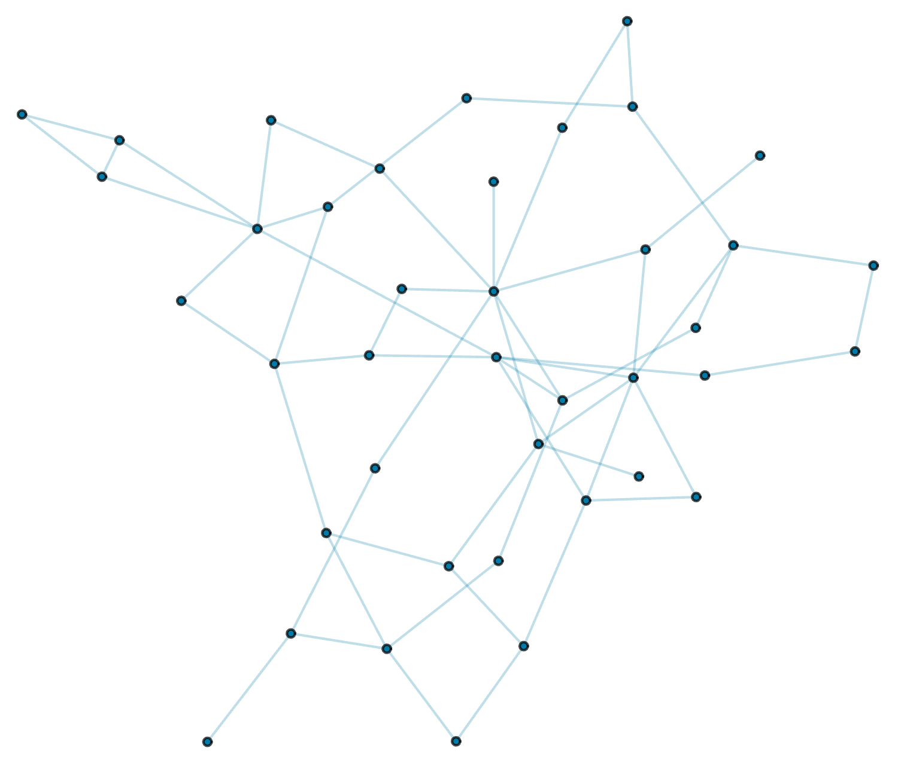

Welcome to the new Markdown publishing workflow! This example post showcases all the content types and formatting options you might want to use when writing your articles.

## 1. Text Formatting & Hierarchy
You can write headings, sub-headings, and standard body text with simple styling:

* **Bold Text:** Wrap text in double asterisks (`**bold**`).
* *Italic Text:* Wrap text in single asterisks (`*italic*`) or underscores (`_italic_`).
* `Inline Code`: Wrap code or terms in backticks (`` `code` ``).

### Subsection Checklist
1. Write the draft in Markdown.
2. Add YAML frontmatter at the top.
3. Commit and push!

Here is a sample table showing various data alignments:

| Item ID | Description | Quantity | Unit Price | Total |
| :--- | :--- | :---: | ---: | ---: |
| 101 | Standard Widget with long text description to test responsive wrapping | 2 | $10.00 | $20.00 |
| 102 | Premium Widget | 1 | $45.00 | $45.00 |
| 103 | Deluxe Edition | 5 | $100.00 | $500.00 |

---

## 2. Lists and Lists Items
You can create ordered and unordered lists easily:

- **Unordered List Item 1**
- **Unordered List Item 2**
  - Indented sub-items are also supported.
  - Another sub-item.

---

## 3. Code Blocks with Syntax Highlighting
Write multi-line code blocks with language-specific syntax highlighting (powered by Prism.js):

### Wolfram Language (WL) Example
Sampling and plotting an Erdős-Rényi random graph:

```mathematica
(* Sample and plot an Erdős-Rényi random graph G(n, p) *)
g = RandomGraph[BernoulliGraphDistribution[40, 0.07]];
Graph[g, 
  VertexSize -> Medium, 
  VertexStyle -> RGBColor[0.0, 0.48, 0.65], 
  EdgeStyle -> Directive[Opacity[0.25], RGBColor[0.0, 0.48, 0.65]]]
```



---

## 4. Media & Embeds
You can embed images using simple Markdown syntax. By default, the build system automatically wraps them in a `<figure class="post__image">` container and generates responsive `srcset` and `sizes` attributes if matching sizes are found on disk under the image's `responsive/` directory.

### Standard Image:


### Image with Custom Dimensions:
You can specify the image width and height using the `=widthxheight` syntax (e.g. `=600x380` or `=600x` to specify width only) in the image target brackets:


### Image with Custom Alignment:
You can also specify the alignment (`left`, `right`, or `center`) by appending it after the image path or size. The default alignment is `center`:


This paragraph of text will wrap around the left-aligned image. It showcases how simple it is to lay out dynamic content with varying visual components on your blog using standard Markdown syntax extensions.

<div style="clear: both;"></div>

---

## 5. Raw HTML Support
You can drop raw HTML blocks directly into the page (e.g. for embeds, customized styling, or video players). The Markdown compiler protects these tags and keeps them as-is:

<figure class="post__video">
  <iframe width="560" height="315" src="https://www.youtube.com/embed/mBQfjY_g-pI?si=Dcqqdh0GYgURq4XK" title="YouTube video player" frameborder="0" allow="accelerometer; autoplay; clipboard-write; encrypted-media; gyroscope; picture-in-picture; web-share" referrerpolicy="strict-origin-when-cross-origin" allowfullscreen></iframe>
</figure>

Enjoy writing!
